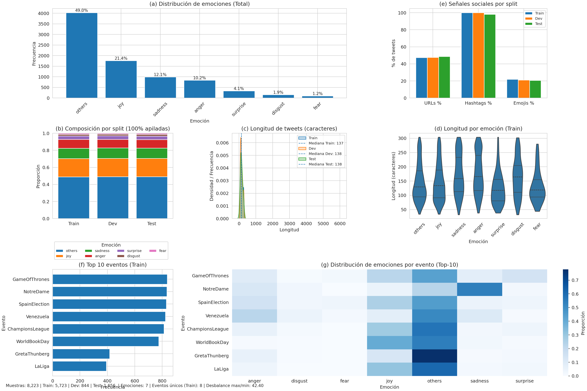
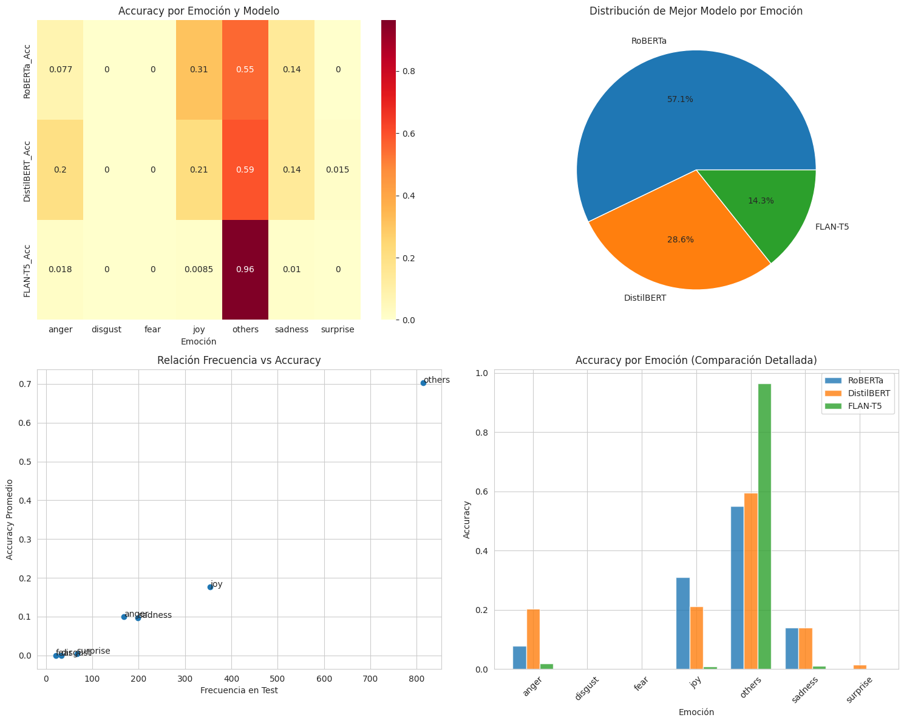

# Trabajo Final de NLP — EmoEvent - Realizado por Gabriel Garcia

**Fecha:** 2025-09-01

## Objetivo

Clasificar emociones en tweets en español (7 clases: `anger`, `disgust`, `fear`, `joy`, `other`, `sadness`, `surprise`) usando tres enfoques:

- **XLM-RoBERTa-base** (fine-tuning, encoder)
- **DistilBERT multilingüe** (fine-tuning, encoder)
- **FLAN-T5-base** (few-shot prompting, generativo)

## Dataset

**EmoEvent (split ES)** — tweets asociados a eventos, anotados con una de 7 emociones.
Fuente: https://github.com/fmplaza/EmoEvent/tree/master/splits/es

## EDA (vista rápida)

## Comparación Gráfica de los Modelos

## Resultados

| Modelo | Tipo | Parámetros | Accuracy | Macro F1 | Weighted F1 |
| --- | --- | --- | --- | --- | --- |
| DistilBERT-multilingual | Fine-tuning (Encoder) | 66M | 0.3756 | 0.1617 | 0.3556 |
| XLM-RoBERTa-base | Fine-tuning (Encoder) | 278M | 0.3617 | 0.1477 | 0.3437 |
| FLAN-T5-base | Few-shot (Generativo) | 248M | 0.4789 | 0.1025 | 0.3289 |

_Fuente de la tabla: `results/final_comparison.csv`_
